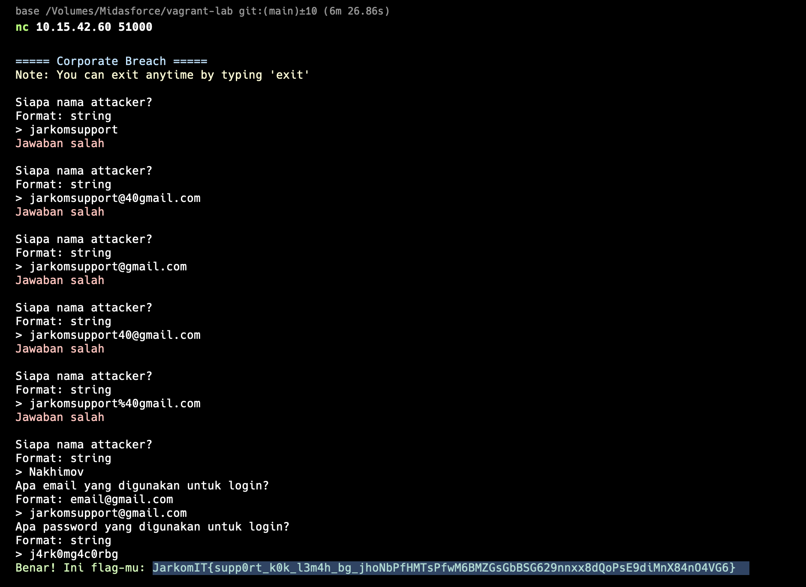
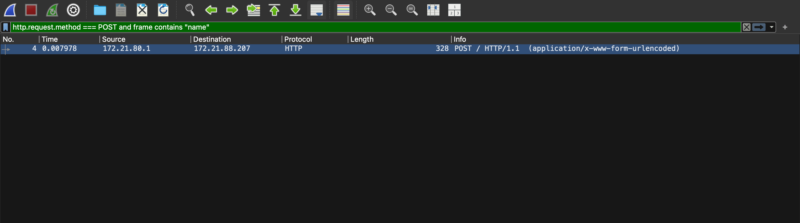
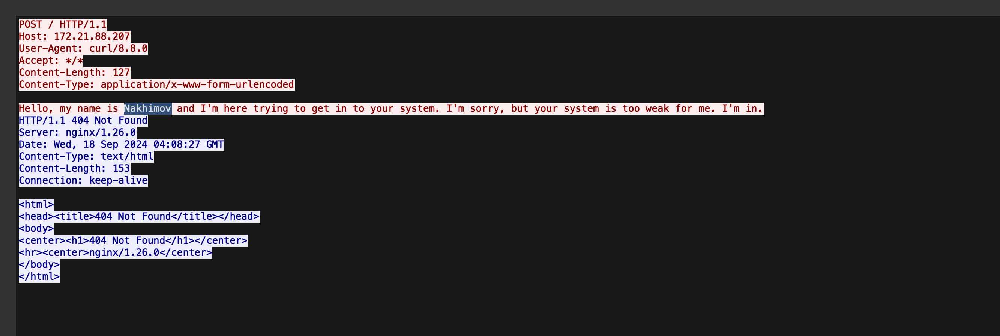
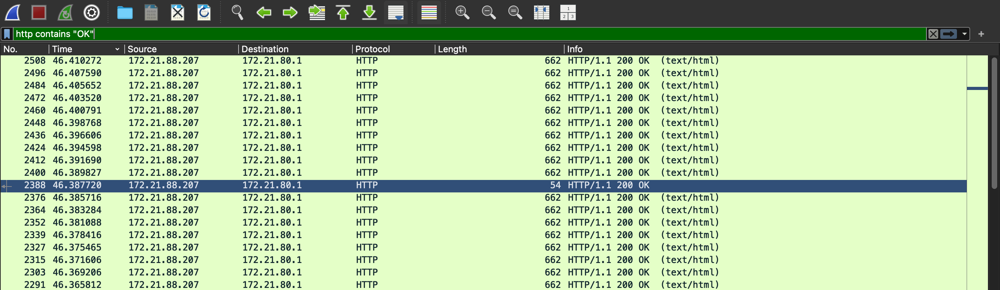
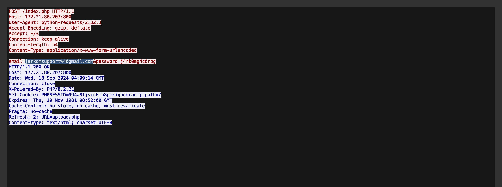
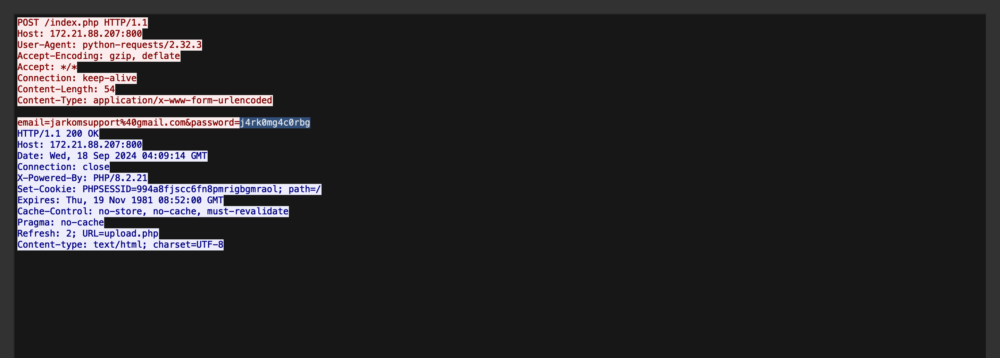
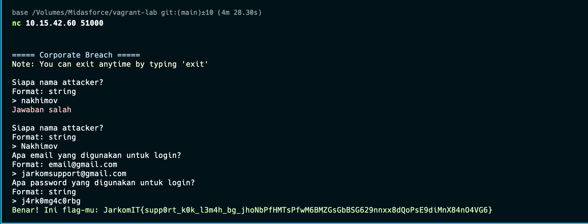

http trus cari 
frame contains "name" and http.request.method === POST

cari email yang beda sendiri post

Benar! Ini flag-mu: JarkomIT{supp0rt_k0k_l3m4h_bg_jhoNbPfHMTsPfwM6BMZGsGbBSG629nnxx8dQoPsE9diMnX84nO4VG6}